# Oficina Mecânica - API Principal

## 📋 Descrição do Projeto

Este repositório contém a **API RESTful principal** do sistema de gerenciamento de Oficina Mecânica, desenvolvida com **FastAPI** e **Python 3.12**. A aplicação implementa a lógica de negócio para gerenciamento completo de uma oficina, incluindo usuários, veículos, peças, serviços, orçamentos e ordens de serviço.

### Propósito
- Fornecer API REST para gestão de oficina mecânica
- Implementar CRUD completo para todas as entidades
- Seguir princípios de Clean Architecture
- Garantir segurança via autenticação JWT
- Suportar deploy em containers (Docker/Kubernetes)
- Integrar com banco de dados MySQL (RDS)

### Funcionalidades Principais
- **Gestão de Usuários**: Clientes e funcionários
- **Gestão de Veículos**: Cadastro e consulta de veículos
- **Gestão de Peças**: Controle de estoque de peças
- **Gestão de Serviços**: Catálogo de serviços oferecidos
- **Orçamentos**: Criação e acompanhamento de orçamentos
- **Ordens de Serviço**: Controle de serviços em andamento
- **Autenticação JWT**: Integração com Lambda de autenticação
- **Observabilidade**: Logs estruturados e integração Datadog

---

## 🛠️ Tecnologias Utilizadas

### Backend
- **Python 3.12** - Linguagem de programação
- **FastAPI 0.116** - Framework web moderno e rápido
- **Pydantic** - Validação de dados e serialização
- **SQLAlchemy** - ORM para persistência
- **PyMySQL** - Driver MySQL
- **Uvicorn** - Servidor ASGI de alta performance
- **python-dotenv** - Gerenciamento de variáveis de ambiente

### Segurança
- **PyJWT** - Validação de tokens JWT
- **bcrypt** - Hash de senhas
- **python-jose** - Criptografia e tokens

### Observabilidade
- **ddtrace** - APM Datadog
- **JSON Logging** - Logs estruturados
- **Correlation IDs** - Rastreamento distribuído

### Testes
- **pytest** - Framework de testes
- **pytest-cov** - Cobertura de código
- **httpx** - Cliente HTTP para testes
- **pytest-asyncio** - Suporte a testes assíncronos

### Infraestrutura
- **Docker** - Containerização
- **Docker Compose** - Orquestração local
- **Kubernetes** - Orquestração em produção (EKS)
- **GitHub Actions** - CI/CD
- **MySQL 8.0** - Banco de dados

### Cloud (AWS)
- **Amazon EKS** - Kubernetes gerenciado
- **Amazon RDS** - MySQL gerenciado
- **AWS Lambda** - Serviço de autenticação
- **API Gateway** - Exposição de APIs

---

## 🚀 Passos para Execução e Deploy

### Pré-requisitos

- Docker 20.10+ e Docker Compose 2.0+
- Python 3.12+ (para desenvolvimento local)
- kubectl (para deploy em K8s)
- Conta AWS (para deploy em produção)

### Execução Local com Docker Compose

#### Passo 1: Clonar o repositório

```bash
git clone <URL_DO_REPOSITORIO>
cd oficina-mecanica-fase1
```

#### Passo 2: Configurar variáveis de ambiente

```bash
cp .env.example .env
```

Edite o arquivo `.env`:

```env
# Database
DB_HOST=db
DB_PORT=3306
DB_USER=root
DB_PASSWORD=root
DB_NAME=oficina_fase1

# JWT
JWT_SECRET=seu_secret_super_seguro_aqui_min_32_chars
JWT_ISSUER=oficina-auth
JWT_AUDIENCE=oficina-api
JWT_TTL_SECONDS=3600

# Application
APP_ENV=development
LOG_LEVEL=INFO

# Datadog (opcional)
DD_TRACE_ENABLED=false
DD_ENV=local
DD_SERVICE=oficina-api
```

#### Passo 3: Subir os containers

```bash
docker-compose up --build
```

Serviços iniciados:
- **API**: `http://localhost:8000`
- **MySQL**: `localhost:3306`
- **Swagger UI**: `http://localhost:8000/docs`
- **ReDoc**: `http://localhost:8000/redoc`

#### Passo 4: Criar schema do banco de dados

```bash
# Copiar script SQL para o container
docker-compose exec db mysql -u root -proot oficina_fase1 < scripts/create_db_oficina.sql
```

Ou executar diretamente:

```bash
docker-compose exec db bash
mysql -u root -proot oficina_fase1 < /scripts/create_db_oficina.sql
```

#### Passo 5: Testar a API

**Via Browser:**
- Acesse `http://localhost:8000/docs`

**Via cURL:**
```bash
# Health check
curl http://localhost:8000/

# Listar veículos
curl http://localhost:8000/veiculos
```

#### Passo 6: Executar testes

```bash
# Testes com cobertura
docker-compose exec api pytest tests/ -v --cov=app --cov-report=html

# Ou localmente (requer Python 3.12)
pytest tests/ -v --cov=app --cov-report=term-missing
```

Visualizar relatório:
```bash
open htmlcov/index.html
```

#### Passo 7: Parar os containers

```bash
docker-compose down

# Remover volumes (dados serão perdidos)
docker-compose down -v
```

### Execução Local sem Docker

#### Passo 1: Criar ambiente virtual

```bash
python3.12 -m venv venv
source venv/bin/activate  # Linux/Mac
# ou
venv\Scripts\activate  # Windows
```

#### Passo 2: Instalar dependências

```bash
pip install -r requirements.txt
```

#### Passo 3: Configurar banco de dados

Você precisa de um MySQL rodando. Opções:

**Docker:**
```bash
docker run --name mysql-oficina \
  -e MYSQL_ROOT_PASSWORD=root \
  -e MYSQL_DATABASE=oficina_fase1 \
  -p 3306:3306 \
  -d mysql:8.0
```

**Local:**
```bash
mysql -u root -p -e "CREATE DATABASE oficina_fase1;"
```

#### Passo 4: Criar schema

```bash
mysql -u root -p oficina_fase1 < scripts/create_db_oficina.sql
```

#### Passo 5: Configurar .env

```bash
cp .env.example .env
# Edite DB_HOST para localhost
```

#### Passo 6: Executar aplicação

```bash
uvicorn app.main:app --reload --host 0.0.0.0 --port 8000
```

Acesse `http://localhost:8000/docs`

### Deploy em Kubernetes (EKS)

#### Pré-requisitos

1. Cluster EKS criado (ver repositório `oficina-infra-k8s-terraform`)
2. Banco de dados RDS criado (ver repositório `oficina-infra-db-terraform`)
3. kubectl configurado
4. Imagem Docker publicada no Docker Hub

#### Passo 1: Build e push da imagem

```bash
# Login no Docker Hub
docker login

# Build da imagem
docker build -t seu-usuario/oficina-api:latest .

# Push para Docker Hub
docker push seu-usuario/oficina-api:latest
```

#### Passo 2: Criar namespace

```bash
kubectl create namespace oficina
```

#### Passo 3: Criar secrets

```bash
kubectl create secret generic db-credentials \
  --from-literal=DB_HOST=seu-rds-endpoint.amazonaws.com \
  --from-literal=DB_PORT=3306 \
  --from-literal=DB_USER=admin \
  --from-literal=DB_PASSWORD=sua_senha \
  --from-literal=DB_NAME=oficina_db \
  -n oficina

kubectl create secret generic jwt-secret \
  --from-literal=JWT_SECRET=seu_secret_super_seguro \
  --from-literal=JWT_ISSUER=oficina-auth \
  --from-literal=JWT_AUDIENCE=oficina-api \
  --from-literal=JWT_TTL_SECONDS=3600 \
  -n oficina
```

Ou usando o manifest:
```bash
# Edite k8s/secret.yaml com valores base64
kubectl apply -f k8s/secret.yaml
```

#### Passo 4: Aplicar manifests

```bash
# Deployment
kubectl apply -f k8s/deployment.yaml

# Service
kubectl apply -f k8s/service.yaml

# HPA (Horizontal Pod Autoscaler)
kubectl apply -f k8s/hpa.yaml
```

#### Passo 5: Verificar deploy

```bash
# Listar pods
kubectl get pods -n oficina

# Ver logs
kubectl logs -f deployment/oficina-api -n oficina

# Descrever deployment
kubectl describe deployment oficina-api -n oficina

# Verificar HPA
kubectl get hpa -n oficina
```

#### Passo 6: Obter URL da aplicação

```bash
kubectl get svc oficina-api -n oficina
```

Output:
```
NAME          TYPE           EXTERNAL-IP
oficina-api   LoadBalancer   a1b2c3...elb.amazonaws.com
```

Acesse: `http://a1b2c3...elb.amazonaws.com/docs`

### Deploy Automatizado via GitHub Actions

#### Configurar Secrets no GitHub

Vá em `Settings > Secrets and variables > Actions`:

```
AWS_ACCESS_KEY_ID       = [sua_access_key]
AWS_SECRET_ACCESS_KEY   = [sua_secret_key]
AWS_REGION              = us-east-1
KUBE_CONFIG_DATA        = [base64 do kubeconfig]
DOCKERHUB_USERNAME      = seu-usuario
DOCKERHUB_TOKEN         = seu-token
DB_HOST                 = seu-rds-endpoint
DB_PASSWORD             = senha-do-db
JWT_SECRET              = seu-secret-jwt
```

#### Fazer Deploy

```bash
git add .
git commit -m "Deploy to EKS"
git push origin main
```

Pipeline executará:
1. Testes automatizados
2. Build da imagem Docker
3. Push para Docker Hub
4. Deploy no EKS
5. Health checks

### Rollback de Deploy

```bash
# Ver histórico
kubectl rollout history deployment/oficina-api -n oficina

# Rollback para versão anterior
kubectl rollout undo deployment/oficina-api -n oficina

# Rollback para versão específica
kubectl rollout undo deployment/oficina-api --to-revision=2 -n oficina
```

### Escalar Aplicação

```bash
# Manual
kubectl scale deployment oficina-api --replicas=5 -n oficina

# Via HPA (automático)
# Edite k8s/hpa.yaml e aplique
kubectl apply -f k8s/hpa.yaml
```

---

## 🏗️ Diagrama de Arquitetura

### Visão Geral da Arquitetura

O diagrama abaixo ilustra a arquitetura completa do sistema.

```mermaid
graph TB
    subgraph "CLIENT LAYER"
        Browser[fa:fa-globe Browser<br/>Web Application]
        Mobile[fa:fa-mobile Mobile App<br/>iOS/Android]
        Postman[fa:fa-flask Postman<br/>API Testing]
    end

    subgraph "AUTHENTICATION SERVICE"
        Lambda[fa:fa-bolt AWS Lambda<br/>Auth Service<br/>JWT Generation]
    end

    subgraph "KUBERNETES CLUSTER - EKS"
        subgraph "LOAD BALANCER"
            LB[fa:fa-balance-scale AWS Load Balancer<br/>Type: LoadBalancer<br/>Port: 80 -> 8000<br/>Health Checks]
        end

        subgraph "NAMESPACE: oficina"
            subgraph "PODS - oficina-api"
                subgraph "POD 1"
                    subgraph "PRESENTATION LAYER"
                        FastAPI1[fa:fa-server FastAPI App<br/>main.py<br/>Port: 8000]
                        
                        Routes1[fa:fa-route API Routes<br/>- /usuarios<br/>- /clientes<br/>- /funcionarios<br/>- /veiculos<br/>- /pecas<br/>- /servicos<br/>- /orcamentos<br/>- /ordens]
                        
                        Middleware1[Middleware<br/>- CORS<br/>- JWT Validation<br/>- Exception Handlers<br/>- JSON Logging]
                    end

                    subgraph "APPLICATION LAYER"
                        UseCases1[fa:fa-cogs Use Cases<br/>Business Logic<br/>- CriarVeiculo<br/>- CriarOrcamento<br/>- CriarOrdemServico]
                        
                        DTOs1[fa:fa-exchange DTOs<br/>Data Transfer Objects<br/>Request/Response Models]
                        
                        Interfaces1[fa:fa-plug Interfaces<br/>Abstract Repositories<br/>Dependency Injection]
                    end

                    subgraph "DOMAIN LAYER"
                        Entities1[fa:fa-cube Entities<br/>Business Objects<br/>- Veiculo<br/>- Orcamento<br/>- OrdemServico<br/>- Cliente<br/>- Funcionario]
                        
                        Rules1[fa:fa-check Business Rules<br/>Validations<br/>Domain Logic]
                    end

                    subgraph "INFRASTRUCTURE LAYER"
                        Repos1[fa:fa-database Repositories<br/>SQLAlchemy<br/>Database Access]
                        
                        Models1[fa:fa-table ORM Models<br/>SQLAlchemy Models<br/>Database Mapping]
                        
                        Mappers1[fa:fa-arrows Mappers<br/>Entity <-> Model<br/>Conversion Logic]
                    end

                    subgraph "CORE LAYER"
                        Config1[fa:fa-cog Config<br/>Environment Variables<br/>Settings]
                        
                        DB1[fa:fa-plug Database Connection<br/>SQLAlchemy Session<br/>Connection Pool]
                        
                        Security1[fa:fa-lock Security<br/>JWT Validation<br/>Auth Dependencies]
                    end
                end

                Pod2[fa:fa-cube POD 2<br/>Same Structure<br/>Load Balanced]
                Pod3[fa:fa-cube POD 3<br/>Same Structure<br/>Load Balanced]
            end

            HPA[fa:fa-expand Horizontal Pod Autoscaler<br/>Min: 2, Max: 10<br/>Target CPU: 70%<br/>Auto Scaling]

            Secrets[fa:fa-key Kubernetes Secrets<br/>- DB_HOST<br/>- DB_PASSWORD<br/>- JWT_SECRET<br/>Base64 Encoded]

            ConfigMaps[fa:fa-file-code ConfigMaps<br/>- APP_ENV<br/>- LOG_LEVEL<br/>- CORS_ORIGINS]
        end
    end

    subgraph "DATABASE LAYER - AWS RDS"
        RDS[(fa:fa-database MySQL 8.0<br/>oficina_db<br/>Managed Service)]
        
        subgraph "DATABASE SCHEMA"
            TableClientes[(fa:fa-table clientes<br/>- id PK<br/>- cpf UNIQUE<br/>- nome<br/>- email<br/>- ativo)]
            
            TableFuncionarios[(fa:fa-table funcionarios<br/>- id PK<br/>- cpf UNIQUE<br/>- nome<br/>- email<br/>- ativo)]
            
            TableVeiculos[(fa:fa-table veiculos<br/>- id PK<br/>- placa<br/>- modelo<br/>- ano<br/>- cliente_id FK)]
            
            TablePecas[(fa:fa-table pecas<br/>- id PK<br/>- nome<br/>- preco<br/>- estoque)]
            
            TableServicos[(fa:fa-table servicos<br/>- id PK<br/>- nome<br/>- preco<br/>- tempo_estimado)]
            
            TableOrcamentos[(fa:fa-table orcamentos<br/>- id PK<br/>- valor_total<br/>- status<br/>- veiculo_id FK)]
            
            TableOrdens[(fa:fa-table ordens_servico<br/>- id PK<br/>- status<br/>- data_inicio<br/>- data_fim<br/>- orcamento_id FK)]
        end
    end

    subgraph "OBSERVABILITY"
        Datadog[fa:fa-chart-line Datadog APM<br/>- Distributed Tracing<br/>- Performance Metrics<br/>- Error Tracking]
        
        CloudWatch[fa:fa-chart-bar CloudWatch<br/>- Container Logs<br/>- Application Logs<br/>- Metrics & Alarms]
        
        Prometheus[fa:fa-chart-area Prometheus<br/>- Custom Metrics<br/>- Future Integration]
    end

    subgraph "CI/CD PIPELINE"
        GitHub[fa:fa-github GitHub Actions<br/>Workflow<br/>Triggered on Push]
        
        subgraph "PIPELINE STAGES"
            Tests[fa:fa-flask Run Tests<br/>pytest<br/>Coverage Report]
            
            Build[fa:fa-docker Build Docker Image<br/>docker build<br/>Tag: latest]
            
            Push[fa:fa-cloud Push to Registry<br/>Docker Hub<br/>seu-usuario/oficina-api]
            
            Deploy[fa:fa-rocket Deploy to EKS<br/>kubectl apply<br/>Rolling Update]
            
            Health[fa:fa-heartbeat Health Checks<br/>Verify Deployment<br/>Readiness Probes]
        end
    end

    subgraph "CONTAINER REGISTRY"
        DockerHub[fa:fa-docker Docker Hub<br/>Container Images<br/>oficina-api:latest<br/>oficina-api:v1.0.0]
    end

    %% Client Flow
    Browser -->|HTTPS Request| LB
    Mobile -->|HTTPS Request| LB
    Postman -->|HTTPS Request| LB
    
    %% Authentication Flow
    Browser -->|POST /auth| Lambda
    Lambda -->|JWT Token| Browser
    Browser -->|Bearer Token| LB
    
    %% Load Balancer to Pods
    LB -->|Distribute Traffic| FastAPI1
    LB -->|Distribute Traffic| Pod2
    LB -->|Distribute Traffic| Pod3
    
    %% Internal Pod Flow
    FastAPI1 --> Middleware1
    Middleware1 --> Routes1
    Routes1 --> UseCases1
    UseCases1 --> DTOs1
    DTOs1 --> Interfaces1
    Interfaces1 --> Entities1
    Entities1 --> Rules1
    Rules1 --> Repos1
    Repos1 --> Models1
    Models1 --> Mappers1
    
    %% Core Dependencies
    Repos1 --> DB1
    Routes1 --> Security1
    FastAPI1 --> Config1
    
    %% Secrets and Config
    FastAPI1 -->|Read| Secrets
    FastAPI1 -->|Read| ConfigMaps
    
    %% Database Connection
    DB1 -->|SQL Queries| RDS
    RDS --> TableClientes
    RDS --> TableFuncionarios
    RDS --> TableVeiculos
    RDS --> TablePecas
    RDS --> TableServicos
    RDS --> TableOrcamentos
    RDS --> TableOrdens
    
    %% Auto Scaling
    HPA -->|Monitors & Scales| FastAPI1
    HPA -->|Monitors & Scales| Pod2
    HPA -->|Monitors & Scales| Pod3
    
    %% Observability
    FastAPI1 -.->|Send Traces| Datadog
    FastAPI1 -.->|Send Logs| CloudWatch
    Pod2 -.->|Send Logs| CloudWatch
    Pod3 -.->|Send Logs| CloudWatch
    FastAPI1 -.->|Export Metrics| Prometheus
    
    %% CI/CD Flow
    GitHub -->|Trigger| Tests
    Tests -->|Pass| Build
    Build -->|Create Image| Push
    Push -->|Upload| DockerHub
    Push -->|Deploy| Deploy
    Deploy -->|Update| FastAPI1
    Deploy -->|Update| Pod2
    Deploy -->|Update| Pod3
    Deploy -->|Verify| Health
    
    %% Container Registry
    FastAPI1 -.->|Pull Image| DockerHub
    Pod2 -.->|Pull Image| DockerHub
    Pod3 -.->|Pull Image| DockerHub

    %% Styling
    classDef client fill:#4CAF50,stroke:#2E7D32,stroke-width:2px,color:#fff
    classDef auth fill:#FFA726,stroke:#EF6C00,stroke-width:2px,color:#fff
    classDef k8s fill:#326CE5,stroke:#1A4D9F,stroke-width:2px,color:#fff
    classDef presentation fill:#2196F3,stroke:#1565C0,stroke-width:2px,color:#fff
    classDef application fill:#03A9F4,stroke:#0277BD,stroke-width:2px,color:#fff
    classDef domain fill:#00BCD4,stroke:#00838F,stroke-width:2px,color:#fff
    classDef infrastructure fill:#009688,stroke:#00695C,stroke-width:2px,color:#fff
    classDef core fill:#4DB6AC,stroke:#00796B,stroke-width:2px,color:#fff
    classDef database fill:#673AB7,stroke:#4527A0,stroke-width:2px,color:#fff
    classDef monitoring fill:#FF5722,stroke:#D84315,stroke-width:2px,color:#fff
    classDef cicd fill:#28A745,stroke:#1E7E34,stroke-width:2px,color:#fff
    classDef registry fill:#2196F3,stroke:#0D47A1,stroke-width:2px,color:#fff
    
    class Browser,Mobile,Postman client
    class Lambda auth
    class LB,HPA,Secrets,ConfigMaps,Pod2,Pod3 k8s
    class FastAPI1,Routes1,Middleware1 presentation
    class UseCases1,DTOs1,Interfaces1 application
    class Entities1,Rules1 domain
    class Repos1,Models1,Mappers1 infrastructure
    class Config1,DB1,Security1 core
    class RDS,TableClientes,TableFuncionarios,TableVeiculos,TablePecas,TableServicos,TableOrcamentos,TableOrdens database
    class Datadog,CloudWatch,Prometheus monitoring
    class GitHub,Tests,Build,Push,Deploy,Health cicd
    class DockerHub registry
```



> 💡 **Nota**: Este diagrama é renderizado automaticamente no GitHub. Arquivo fonte: [architecture.mmd](architecture.mmd)


### Exemplos de Requisições

#### 1. Autenticação (Lambda)

```bash
curl -X POST https://seu-api-gateway.amazonaws.com/auth \
  -H "Content-Type: application/json" \
  -d '{"cpf": "12345678901"}'

# Response:
# {
#   "access_token": "eyJhbGciOiJIUzI1NiIsInR5cCI6IkpXVCJ9...",
#   "token_type": "bearer"
# }
```

#### 2. Listar Veículos

```bash
TOKEN="eyJhbGciOiJIUzI1NiIsInR5cCI6IkpXVCJ9..."

curl -X GET http://localhost:8000/veiculos \
  -H "Authorization: Bearer $TOKEN"
```

#### 3. Criar Orçamento

```bash
curl -X POST http://localhost:8000/orcamentos \
  -H "Authorization: Bearer $TOKEN" \
  -H "Content-Type: application/json" \
  -d '{
    "veiculo_id": 1,
    "servicos": [1, 2],
    "pecas": [{"id": 1, "quantidade": 2}],
    "descricao": "Troca de óleo e filtros"
  }'
```

---

## 📝 Estrutura do Projeto (Clean Architecture)

```
oficina-mecanica-fase1/
├── app/
│   ├── main.py                 # Entry point da aplicação
│   ├── core/                   # Configurações e utilitários
│   │   ├── config.py           # Variáveis de ambiente
│   │   ├── database.py         # Conexão com banco
│   │   ├── security.py         # JWT validation
│   │   ├── exceptions.py       # Custom exceptions
│   │   └── dependencies.py     # FastAPI dependencies
│   │
│   └── modules/                # Módulos de negócio
│       ├── usuario/
│       │   ├── domain/
│       │   │   └── entities.py           # Cliente, Funcionario
│       │   ├── application/
│       │   │   ├── use_cases.py          # Lógica de negócio
│       │   │   ├── dto.py                # Data Transfer Objects
│       │   │   └── interfaces.py         # Abstract repositories
│       │   ├── infrastructure/
│       │   │   ├── models.py             # SQLAlchemy models
│       │   │   ├── repositories.py       # Implementação repos
│       │   │   └── mapper.py             # Entity <-> Model
│       │   └── presentation/
│       │       └── routes.py             # FastAPI routes
│       │
│       ├── veiculo/
│       │   ├── domain/
│       │   ├── application/
│       │   ├── infrastructure/
│       │   └── presentation/
│       │
│       ├── peca/, servico/, orcamento/, ordem_servico/
│       │   └── [same structure]
│
├── tests/                      # Testes automatizados
│   ├── test_usuarios.py
│   ├── test_veiculos.py
│   ├── test_orcamento.py
│   └── conftest.py             # Fixtures pytest
│
├── k8s/                        # Kubernetes manifests
│   ├── deployment.yaml
│   ├── service.yaml
│   ├── hpa.yaml
│   ├── secret.yaml
│   └── namespace.yaml
│
├── scripts/
│   └── create_db_oficina.sql   # Schema do banco
│
├── docs/
│   ├── ci-cd.md
│   └── terraform.md
│
├── Dockerfile
├── docker-compose.yml
├── requirements.txt
├── pytest.ini
├── .coveragerc
└── README_2.md
```

---

## 🔐 Segurança

- **JWT Authentication**: Tokens validados em cada requisição
- **HTTPS**: TLS/SSL em produção
- **CORS**: Configurado para origens permitidas
- **SQL Injection**: Prevenido pelo SQLAlchemy
- **Secrets**: Gerenciados via K8s Secrets ou AWS Secrets Manager
- **Rate Limiting**: Implementável via API Gateway

---

## 🧪 Testes

```bash
# Todos os testes
pytest

# Com cobertura
pytest --cov=app --cov-report=html

# Testes específicos
pytest tests/test_veiculos.py -v

# Com logs
pytest -v -s
```

---

## 📞 Suporte

Para dúvidas ou problemas:
- Email: lamequesao@gmail.com
- Discord: lamequesao

---

## 📄 Licença

Este projeto é parte do Tech Challenge da FIAP - 12SOAT.
